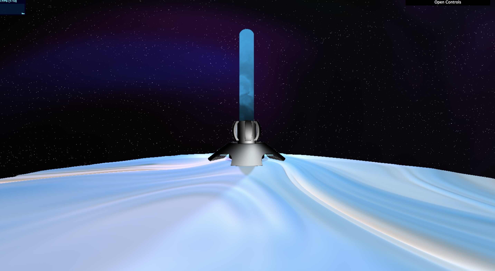
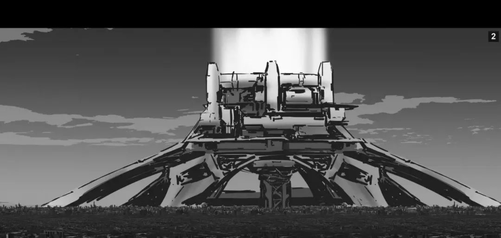
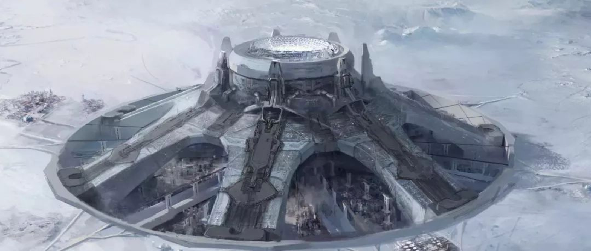
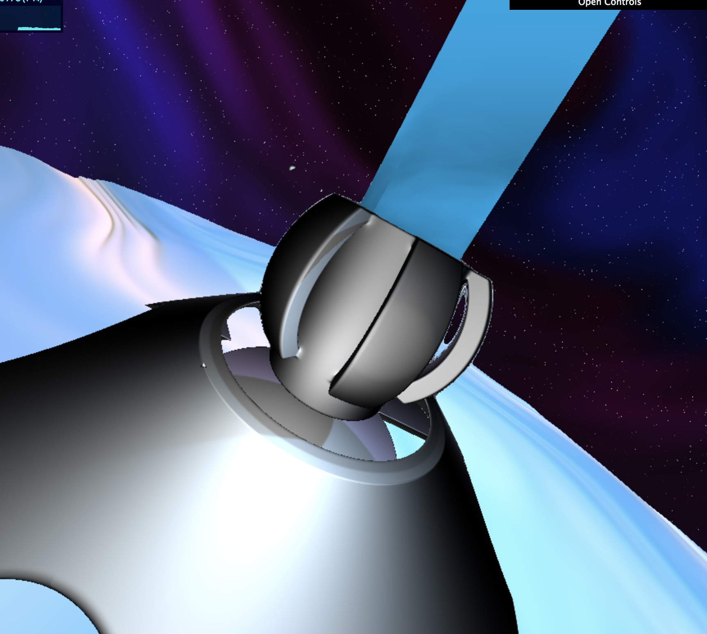
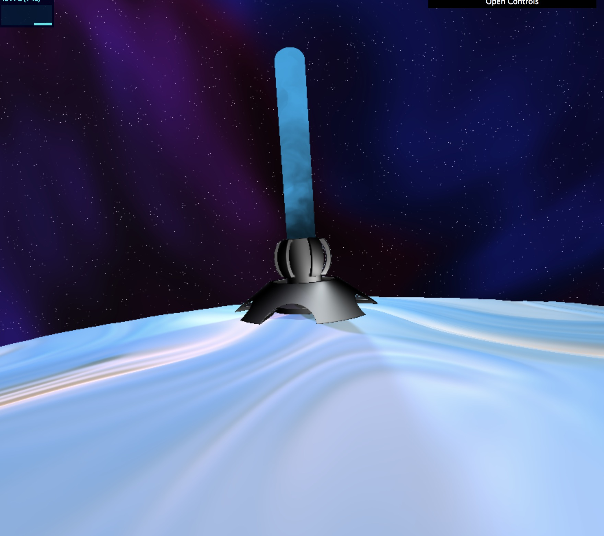
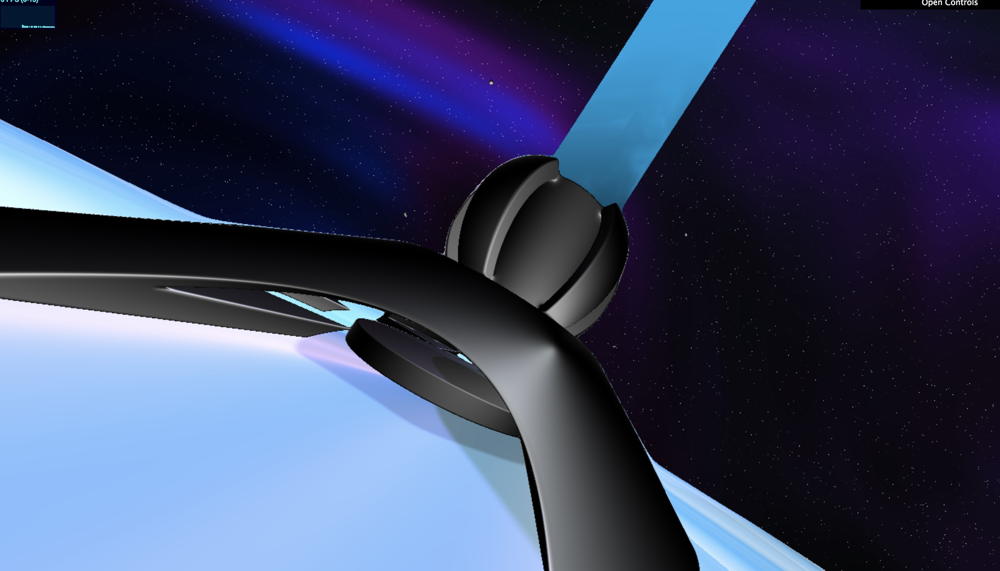
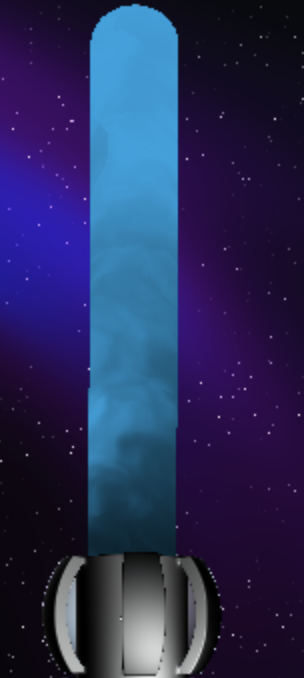

# CIS 566 Homework 3: Environment Setpiece

## Programmer Information

- Name: Chianti Yan
- PennKey: 85100574

## Demo Page
This is the link to my github page: <https://chiantiyzy.github.io/hw03-environment-setpiece/> When you open the link, you should see something like this:

This geometry is a rebuild of **earth engine** from the movie **The Wandering Earth**. Reference pictures are as following:

## Project Explained

- **SDF**

  The basic geometry is a cylinder unions a cone and duplicated by side boxes. All sdf related codes are inspired by IQ.

- **Noise Function**

  Noise functions are used for terrain generating, sky generating and the flame generating. Some of the noise functions are from IQ's codes and ShaderToy user lulu250. Here are the reference links:

  **Stars**: https://www.shadertoy.com/view/MlSfzz (Worley Noise)

  **Aurora and Terrain**: https://www.shadertoy.com/view/lsl3RH (FBM)

- **Lights and Shadows**

  There are three **point lights** and an **ambient light** used in this scene. Point lights generated **softShadows** which following the instruction codes by TA Emily Vo: <https://www.shadertoy.com/view/td2GD3?fbclid=IwAR0bkO1nQzKvZpaN5RoxIVhjI739CI49cjm8FYoOjtfDfvRMhGRnT61qORY>

  Here are some shadowing effects:

  

  

  

  Ambient light is added especially on the terrain. And **ray-based specular** color is added on the engine to make it "metaled". 

  

- **Distance Fog**

  Distance Fog is used to generate the flame coming out of the engine: to make it more fire like. I got inspiration from classmate Haoran Wei's fog, and here is his github link: https://github.com/whaoran0718/hw01-noisy-terrain

  The approach is not quite successful. I was about to mimic the shape of smoke but that was too much calculation which crashed my browser, so I tried to mimic the color instead. A closer look to the flame is as below:

  

  The noise function is related to the intersection point, so it looks better when looking from a far distance.

- **Color Remapping**

  Colors are mapped to the intersection position as well as u_Time. **Smoothstep** is used for remapping. 

  
